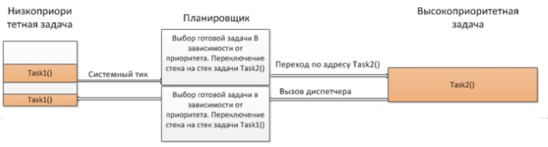
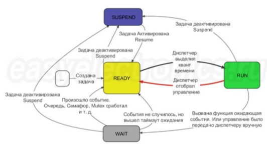
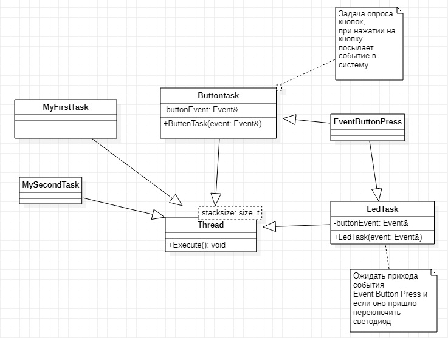

:figure-caption: Рисунок
:toc:
:toc-title: Оглавление
= Лабораторная работа №2 

 Выполнили: Истомин С.В., Соловьев А.А.

==  *Введение* +

Операционные системы реального времени (OCPB(RTOS)) предназначены для обеспечения интерфейса к ресурсам критических по времени систем реального времени. Основной задачей в таких системах является своевременность (timeliness) выполнения обработки данных.

== *Задачи*

Задачей ОСРВ является обеспечение реакции на определенное действие за отведенный квант времени.

Для разных задач такой квант может иметь разное значение, например, для обработки . Приблизительное время реакции в зависимости от области применения ОСРВ может быть следующее:

* *математическое моделирование - несколько микросекунд*
* *радиолокация - несколько миллисекунд*
* *складской учет - несколько секунд*
* *управление производством - несколько минут*

Еще одной задачей ОСРВ является обеспечение многозадачности (или псевдомногозадачности - обеспечение мнимого вид ния одновременного исполнения нескольких операций)

Традиционно существует 2 версии многозадачности:
* *«Мягкого» реального времени(soft real 8time)*
* *«Жесткого» реального времени(hard real time)*

K OCPB мягкого типа можно отнести наши с Вами компьютеры т.е. пользователь должен видеть, что, например, нажав кнопку с символом, он видит введенный символ, а если же он нажал кнопку, и спустя время не увидел реакции, то ОС будет считать задачу «не отвечающей» (по аналогии с Windows - «Программа не отвечает»), но ОС остается пригодной для использования. 
Таким образом, ОСРВ мягкого времени просто определяет предполагаемое время ответа, и если оно истекло, то ОС относит задачу к не отвечающим.

K OCPB жесткого типа, как раз относят OCPB во встраиваемых устройствах. В чем-то они похоже на ОСРВ на десктопах (многопоточное выполнение на одном процессоре), но и имеют главное отличие - каждая задача должна выполняться за отведенный квант времени, не выполнение данного условия ведет к краху все системы.

== *Принцип работы:* +

В ОСPB, используется псевдомногозадачность - так как у вас одно ядро, и каждая задача (или часть задачи) выполняется в отведенное ей время, хотя для пользователя кажется, что все выполняется одновременно

Существует несколько видов многозадачности:

* *Кооперативная - следующая задача не выполнится, пока полностью не завершена предыдущая*
* *Вытесняющая - более высоко-приоритетная задача может вытеснить менее приоритетную*

B OCPB, вместо прерываний используются задачи, которые вызываются планировщиком каждый раз по прерыванию системного таймера (например раз в 1 мс) или при непосредственном вызове планировщика.

Каждый раз планировщик пробегается по списку задач, выбирает задачу готовую к работе.

* *В кооперативной многозадачности планировщик смотрит, завершена ли текущая задача и готова ли следующая (с большим приоритетом)*

* *В вытесняющей планировщик смотрит, готова ли более высокоприоритетная задача. если да, он прерывает работу менее приоритетной задачи и вызывает задачу в большим приоритетом.*

Планировщик озаботится тем, чтобы у каждой задачи все сохранялось и запоминалось: текущее положение, стек, переменные, регистры.

.Схема работы

== *Задача* +

Задача - это мини подпрограмма, которая имеет свою точку входу, и исполняется внутри бесконечного цикла и обычно не должна выходить из него.

У задачи есть такой важный параметр как приоритет. Он задается при создании и его можно на лету вручную менять через API функции RTOS. Приоритет определяет в каком порядке будут работать задачи.

Т.е. если есть две задачи в статусе Ready, но у одной приоритет выше другой. Задача с низким приоритетом в таком случае не получит управление до тех пор, пока высокоприоритетная задача не свалится в WAIT. Диспетчер всегда будет выбирать ту READY задачу у которой приоритет выше.

А если READY задач нет, то будет вызвана пустая задач, встроенная в ОСРВ - IDLE. В котором происходит служебное обслуживание. Ну и туда же (в IDLE) можно передать свою callback функцию, в которой, например, контроллер будет отправляться в режим энергосбережения или рассчитвать загрузку процессора.

.Схема работы "Задачи"

== *FreeRTOS* +

"FreeRTOS — многозадачная операционная система реального времени (ОСРВ) для встраиваемых систем.
Так как мы будем работать именно с FreeRTOS, то надо подключить бибилиотеку: #include "rtos.hpp".

== *Задание* +

Осуществить моргание светодиодами с помощью кнопки и без нее с применением ОСРВ.

== *Схема в StarUML* +

Перед написанием кода продумаем дизайн проекта в StarUML.

.Дизайн проекта

== *Решение* +

Как говорилось в пункте FreeRTOS, сначала подключаем библиотеку:

[source, cpp]
#include "rtos.hpp"  // for Rtos 

Дальше нужно сделать задачу в нашем случае это класс. 
Каждый класс должен наследовать интерфейс Thread с различными функциями, к примеру Sleep и Signal. 
В нём нужно указать размер стека задач.

[source, cpp]
class MyTask : public OsWrapper::Thread<static_cast<std::size_t>(OsWrapper::StackDepth::minimal)>

== *MyFirstTask* +

Для моргания светодиодом создадим класс, который будет наследовать класс Thread c виртуальным методом Execute, в котором мы будем моргать светодиодом и засыпать на 1 секунду. Назовем этот класс MyFirstTask.

[source, cpp]
#pragma once
#include "event.hpp"
#include "thread.hpp" // for Thread
class MyFirstTask: public OsWrapper::Thread(200)
{
public:
  void Execute() override;
};

Описываем метод Execute. При вызове данной задачи загорается светодиод на линии C8, а с помощью функции Sleep задача "засыпает" на 200 мс.

[source, cpp]
#include "myfirsttask.h"
#include "gpiocregisters.hpp" // for GPIOC
void MyFirstTask:: Execute()
{
  for(;;)
  {
    GPIOC::ODR::Toggle(1 << 8);
    Sleep(200ms);
  }
}

После создания обьекта класса, а теперь его нужно зарегистрировать в main.cpp
Прописываем вызов создания задачи, с выбранным приоритетом, и вызов запуска.

[source, cpp]
OsWrapper::Event event{500ms, 1};
OsWrapper::Event buttonEvent{500ms, 1};
ButtonTask buttonTask(buttonEvent)
MyFirstTask myFirstTask;
MySecondTask mySecondTask;
LedTask ledTask(ButtonEvent);
int main()
{
  using namespace OsWrapper;
  Rtos::CreateThread(myFirstTask, "myFirstTask", ThreadPriority::highest); // Задаем приоритет, в данном случае высокий
  Rtos::CreateThread(mySecondTask, "MySecondTask", ThreadPriority::highest);
  Rtos::CreateThread(buttonTask, "ButtonTask", ThreadPriority::normal);
  Rtos::CreateThread(ledTask, "LedTask", ThreadPriority::normal);
  Rtos::Start(); // Вызов запуска
  return 0;
}

== *MySecondTask* +

Также необходимо сделать моргание двух светодиодов уже с другой частотой, используя SleepUntil, эта команда блокирует выполнение текущего потока, пока не будет достигнут указанный момент времени. Для этого используем клласс MySecondTask.

[source, cpp]
#pragma once
#include "event.hpp"
#include "thread.hpp" // for Thread
class MySecondTask: public OsWrapper::Thread(200)
{
public:
  void Execute() override; 
};

В файле mysecondtask.cpp вызываем светодиод, а с помощью функции SleepUntil задача "засыпает" на 100 мс.

[source, cpp]
#include "mysecondtask.h"
#include "gpiocregisters.hpp"
void MySecondTask::Execute()
{
  for(;;)
  {
    GPIOC::ODR::Toggle(1U << 5U);
    SleepUntil(100ms);
  }
}

== *ButtonTask* +

Создадим две задачи для опроса кнопки и зажигания светодиода, данные классы мы указали в StarUML.

В классе ButtonTask проверяем нажата ли кнопка и если нажата отправляем метод сигнала.
В конструктор Event передается время ожидания и маска, те характеристики, что нам надо проверить, в нашем случае у нас одно событие. Но мы будем использовать вместо него MailBox, который используется для передачи сообщений.
Это шаблонный класс передаёт тип и размер.
Таким способом можно передавать сообщения между задачами.

[source, cpp]
#pragma once
#include "event.hpp" // for Event
#include "thread.hpp" //for Thread
class ButtonTask: public OsWrapper::Thread(100)
{
public:
  ButtonTask (OsWrapper::MailBox<int, 1>& mailBox): buttonMailBox(mailBox)
  {
  }
  void Execute() override;
private:
  OsWrapper::MailBox<int, 1>& buttonmailBox;
  int myMessage = 1;
};

Проверяем нажатие кнопки и если кнопка нажата записываем сообщение и усыпляем программу на 100 ms.

[source, cpp]
#include "buttontask.h"
#include "gpiocregisters.hpp"
void ButtonTask::Execute()
{
  for(;;)
  {
    if(GPIOC::IDR::IDR13::Low::IsSet()) //Проверяем нажата ли кнопка
    {
    ButtonMailBox.Put(myMessage);
    }
    Sleep(100ms);
  }
}

== *LedTask* +

Класс LedTask должен ожидать прихода события MailBoxButtonPress и если оно пришло, то переключить светодиод.

[source, cpp]
#pragma once
#include "thread.hpp"
#include "event.hpp"
#include "mailbox.hpp" //for MailBox
class LedTask : public OsWrapper::Thread(200)
{
public:
LedTask(OsWrapper::MailBox<int, 1>& mailBox): buttonMailBox(mailBox)
{
}
void Execute() override;
private:
OsWrapper::MailBox<int, 1>& buttonMailBox;
  int myMessage = 1;
};

В файле ledtask.cpp мы проверяем приход события нажатия кнопки и если событие нажатия кнопки пришло, то включаем светодиод, а затем усыпляем программу на 100 ms.

[source, cpp]
#include "ledtask.h"
#include "gpiocregisters.hpp".h"
void LedTask::Execute()
{
for(;;)
{
if(buttonMailBox.Get(myMessage, 500ms))
{
GPIOC::ODR::ODR9::High::Set();
}
Sleep(100ms);
}
} ;

== *Результат* +

image::IMG_1247.gif[]

== *Код программы* +

[source, cpp]
#include "rtos.hpp"         // for Rtos
#include "mailbox.hpp"      // for Mailbox
#include "event.hpp"        // for Event
#include "mytask.hpp"       // for MyTask
#include "led1task.hpp"     // for Led1Task
#include "rccregisters.hpp" // for RCC
#include "myfirsttask.h" // for MyFirstTask
#include "mysecondtask.h" // for MyFirstTask
#include "buttontask.h" // for MyFirstTask
#include "ledtask.h"     // for LedTask
#include "Application/Diagnostic/GlobalStatus.hpp"
#include <gpioaregisters.hpp>  // for GPIOA
#include <gpiocregisters.hpp>  // for GPIOC
std::uint32_t SystemCoreClock = 16'000'000U;
extern "C" {
int __low_level_init(void)
{
  RCC::CR::HSION::On::Set();
  while (RCC::CR::HSIRDY::NotReady::IsSet())
  {
  }
  RCC::CFGR::SW::Hsi::Set();
  while (!RCC::CFGR::SWS::Hsi::IsSet())
 {
  }
  RCC::AHB1ENRPack<
      RCC::AHB1ENR::GPIOCEN::Enable,
      RCC::AHB1ENR::GPIOAEN::Enable
  >::Set();
  RCC::APB2ENR::SYSCFGEN::Enable::Set();
  GPIOA::MODER::MODER5::Output::Set();
  GPIOC::MODERPack<
      GPIOC::MODER::MODER5::Output,
      GPIOC::MODER::MODER8::Output,
      GPIOC::MODER::MODER9::Output
  >::Set();
  return 1;
}
}
OsWrapper::Event ButtonEvent{500ms, 1};
OsWrapper::MailBox<int,1> ButtonMailBox;
ButtonTask buttonTask(ButtonMailBox);
LedTask ledTask(ButtonMailBox);
OsWrapper::Event buttonEvent{500ms, 1}; // Событие для отправки. Вркмя ожидания отправки
ButtonTask buttonTask(buttonEvent) // Передаем информацию(ссылку)
MyFirstTask myFirstTask;
MySecondTask mySecondTask;
LedTask ledTask(ButtonEvent);
int main()
{
  using namespace OsWrapper;
  Rtos::CreateThread(myFirstTask, "myFirstTask", ThreadPriority::highest);
  Rtos::CreateThread(mySecondTask, "MySecondTask", ThreadPriority::highest);
  Rtos::CreateThread(buttonTask, "ButtonTask", ThreadPriority::normal);
  Rtos::CreateThread(ledTask, "LedTask", ThreadPriority::normal);
  Rtos::Start(); // вызов запуска OS
  return 0;
}
