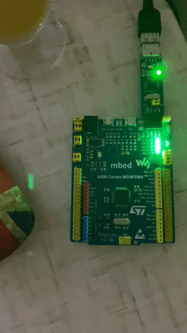

:toc:
:toc-title: ОГЛАВЛЕНИЕ
= Лабораторная работа №4

= Задание
1) Написать программу, которая моргает всеми 4 светодиодами, но без использования магии с GPIOA::ODR::ODR5::High::Set()

2) Нужно описать, как работает операция ИСКЛЮЧАЮЩЕЕ ИЛИ и как поменять значения переменных местами, без привлечения
третьей переменной.

= Решение
== Код программы.

[source, cpp]
#include "gpioaregisters.hpp" //for GPIOC
#include "gpiocregisters.hpp" //for GPIOC
#include "rccregisters.hpp" //for RCC

std::uint32_t SystemCoreClock = 16'000'000U;

extern "C" {
int __low_level_init(void)
{
//Switch on external 16 MHz oscillator
RCC::CR::HSION::On::Set();
while (RCC::CR::HSIRDY::NotReady::IsSet())
{

}
//Switch system clock on external oscillator
RCC::CFGR::SW::Hsi::Set();
while (!RCC::CFGR::SWS::Hsi::IsSet())
{

}

RCC::APB2ENR::SYSCFGEN::Enable::Set();

return 1;
}
}
int delay(int cycles)
{
for(int i=0; i < cycles; ++i)
{
asm volatile ("");
}
}

int main()
{
RCC::AHB1ENR::GPIOAEN::Enable::Set();
GPIOA::MODER::MODER5::Output::Set();
RCC::AHB1ENR::GPIOCEN::Enable::Set();
GPIOC::MODER::MODER5::Output::Set();
GPIOC::MODER::MODER8::Output::Set();
GPIOC::MODER::MODER9::Output::Set();

for(;;)
{

uint32_t* ptrPaOdr = reinterpret_cast<uint32_t*>(0x40020014);
uint32_t* ptrPcOdr = reinterpret_cast<uint32_t*>(0x40020814);
*ptrPaOdr ^= static_cast<uint32_t>(1 << 5);
*ptrPcOdr ^= static_cast<uint32_t>(1 << 5);
*ptrPcOdr ^= static_cast<uint32_t>(1 << 8);
*ptrPcOdr ^= static_cast<uint32_t>(1 << 9);
delay(1000000);
*ptrPaOdr ^= static_cast<uint32_t>(1 << 5);
*ptrPcOdr ^= static_cast<uint32_t>(1 << 5);
*ptrPcOdr ^= static_cast<uint32_t>(1 << 8);
*ptrPcOdr ^= static_cast<uint32_t>(1 << 9);
delay(1000000);

}
return 1;
}

далее посмотрим как это выглядит на плате.

== ИСКЛЮЧАЮЩЕЕ ИЛИ.

Исключающее или выглядит так "^" и работает по принципу если значения разные то это истина, если одинаковые то это лож.
Менять значение с помощью "Исключающего или" можно так.

[source, cpp]
a = a ^ b;
b = b ^ a;
a = a ^ b;
