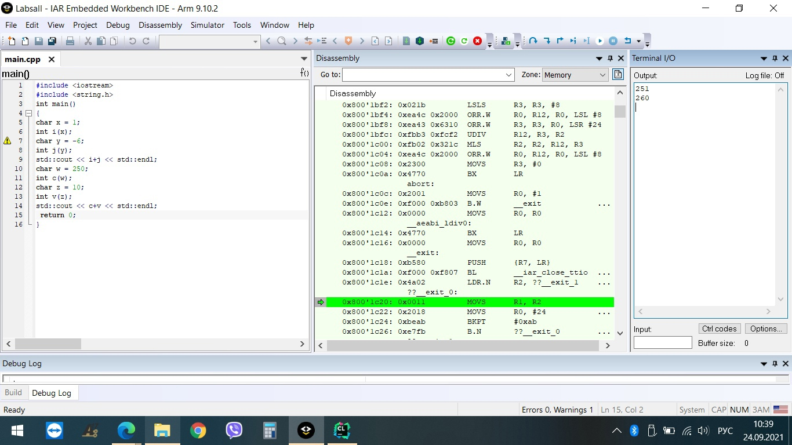
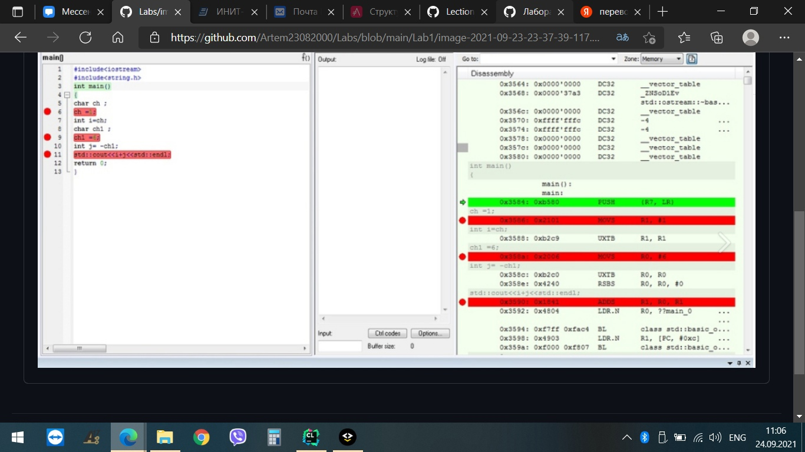
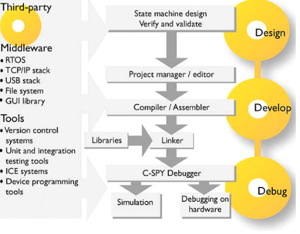

=== МИНИСТЕРСТВО НАУКИ И ВЫСШЕГО ОБРАЗОВАНИЯ РОССИЙСКОЙ ФЕДЕРАЦИИ
=== «Южно-Уральский государственный университет»
=== (национальный исследовательский университет)
=== Высшая школа электроники и компьютерных наук
=== Кафедра «Информационно-измерительная техника»

== Отчет по лабораторной работе №1

== Выполнил: студент группы КЭ-413 C.В. Истомин

== Задание 
* Создать в вашем github репозиторий Labs
* Создать в репозитории Labs папку Lab1
* Создать в папке Lab1 проект Lab1 С++ с main с настройками для микроконтроллера STM32F411RC
* Сделать программу которая считает сумму двух char чисел, попробовать сложить несколько разных числе с кажем и -6, 250 и 10, Вывести результат в Terminal I/O. Объяснить результат.
* Запустить проект на выполнение по симулятором, посмотреть листинг дизамблера - попробовать определить где создались ваши переменные.
* Проверить все переменные в окне watch, сделать пошаговую отладку (F10, F11), посмотреть, как меняются переменные в окне Watch. заупустить окно Resisters и посмотреть значения регистров в которых созданы переменные (если конечно они там созданы)
* Ответить на вопрос к первому разделу

== Решение:

1) Для начала создадим репозиторий на сайте GitHub, назовем его Labs далее в нем создадим папку Lab1 а в нем проект Lab1 С++ с main с настройками для микроконтроллера STM32F411RC.

2) Создадим код программы, которая считает сумму двух char чисел 1 и -6, 250 и 10. Код программы, представленный на рисунке ниже, будет записан в функцию main.

.код программы
 

3) При нажатии на кнопку F9 мы зададим точку остановки.

* Точки остановки нужны для того, чтобы проверить код на правильность написания. Данный способ удобен если имеем программу большого обьема, и чтоб не искать ошибку проверяя правильность каждой строчки, просто прогоняем по этапно до каждой точки откладки и смиотрим где идет сбой.
В режиме отладки можно по этапно(по строчке) проверять программу с помощью кнопок F10, F11. Клавиша F10 продолжает выполнение отладчика без захода в функцию.
Нажав клавишу F10, есть возможность обойти код, который нас устраивает. Так можно быстро перейти к проблемной части программы.

.точки остановки

== *Ответы на вопросы*

[qanda]
*1)* Дайте определение понятию "Интегрированной среде разработки"
----
Ответ:
Интегрированная среда разработки (ИСР) - система программных средств, используемая программистами для разработки программного обеспечения(ПО).
----

*2)* Что такое компилятор и чем он отличается от транслятора?
----
Ответ:
Компилятор - программа выполняющая трансляцию исходного кода из предметно-ориентированногоязыка на мишинно-ориентированный язык. Транслятор - это программа-переводчик. Она преобразует программу, написанную на одном из языков высокого уровня, в программу, состоящую из машинных команд. Компилятор отличается от транслятора языком написание, иначе говоря написана на ассемблере.
----

*3)* Что такое компоновщик и какие функции он выполняет?
----
Ответ:
Компоновщик (Линковщик) - программа собриющая исходный код на машино-ориентированном языке и производящая сборку в исполняемый модуль.
----

*4)* Почему важен процесс проектирования ПО какие задачи входят в этот процесс?
----
Ответ: 
процесс проектирования ПО важен потому, что при его создании происходит структурирование действий каждого отдела какой-либо фирмы например, то есть если такой порядок существует то ПО будет скорее всего создано верно, а без порядка проектирования возможны ошибки при его создании. Процесс проектирования ПО включает следующие задачи: 1)выбор метода и стратегии решения; 2)выбор представления внутренних данных; 3)разработка основного алгоритма; 4)документирование ПО; 5)тестирование и подбор тестов; 6)выбор представления входных данных.
----

*5)* Дорисуйте процесс разработки ПО, описанный на изображении Процесс разработки с точки зрения IAR Workbench с учетом итеративности связей в этом процессе
----
Ответ:
----

*6)* Зачем нужная отладка и в каких случаях она применяется? Для чего применяются точки остановки?
----
Ответ:
Отладка необходима для поиска различных ошибок и багов, возникающих в коде. Также для просмотра изменения значений переменных и т.д. Необходимо исключить ошибку в большом коде, но не понятно где эта ошибка возникает и применяют так называемые точки остановки.Запускают код в режиме отладки и на этой точке программа останавливается и дальше разработчик кнопками F10 или F11 способен идти дальше по коду и искать неизвестную ошибку.
----
*7)* Какие еще важные IAR workbench можно добавить в таблицу [Характеристики IAR]
Ответ:
контроль регистров.
