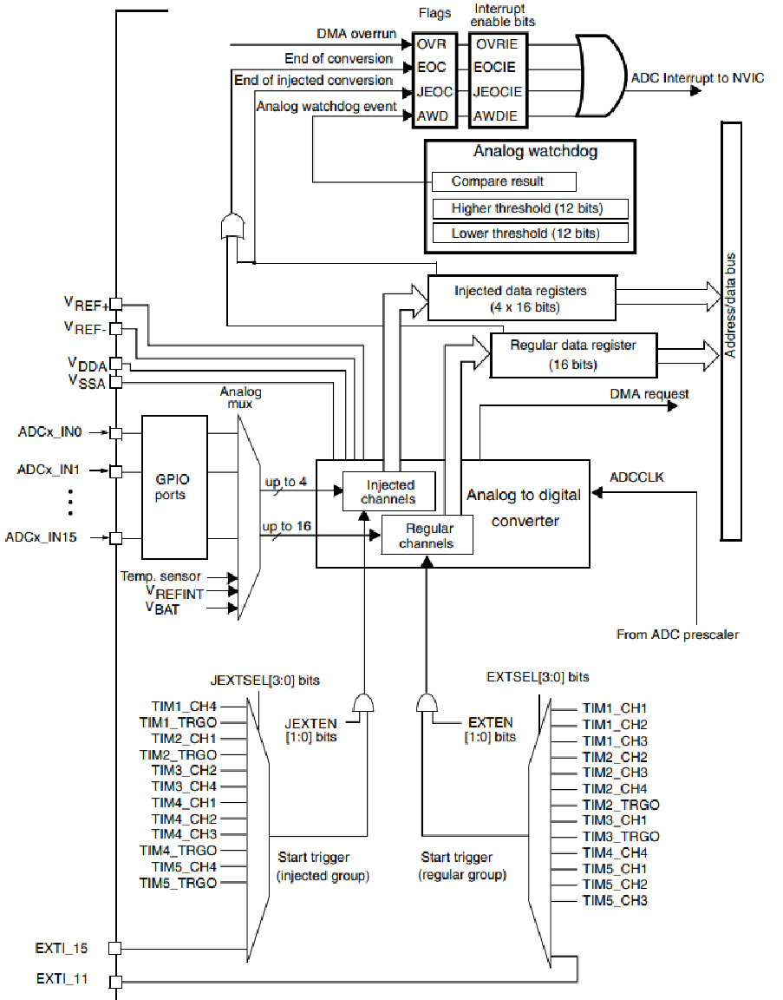

:figure-caption: Рисунок
:toc:
:toc-title: Оглавление
= Анализ требований к разработке

== Тема работы: Разработка устройства управления яркостью
 Выполнили: Истомин С.В., Соловьев А.А.

==  *Требования к курсовому проекту* +

* Для разработки должна использоваться отладочная плата XNUCLEO-F4IIRE

* Софт должен измерятьЪ напряжения с переменного резистора, уставленного на плате расширения

* Для измерения напряжения должен использоваться встроенный АЦП

* Период измерения должен бытъ 50 ms

* Для изменения напряжения должна использоваться плата Accessories Shield или Analog Test Shield 

* Точность измерения напряжения должна быть не менее 0,01 вольта

* К измеренному напряжению должен быть применен цифровой филътр вида: tau = 1 - e^(-dt)/RC

где dt - 100 мс;
Value — текущее нефильтрованное измеренное значение напряжения;
oldValue — предыдущее филътрованное значение.

* Для управления яркостью светодиода должен использоваться модуль PWM

* Светодиод находится на порту PortC.8

* Пepeдaua знаиений по беспроводному интерфейсу должна осуществляться uepeз модуль BlueTooth Bee НС-06 или І/О Expansion Shield 

* Общение с платой расширение должно осуществляться через USART2

* формат вывода: ”Напряжение: " X.XXX [Units]

* Архитектура должна быть представлена в виде UML диаграмм в пакете Star UML

= Решение

== *Микроконтроллер STM32F411RE и отладочная плата на его базе* +

Для разработки должна использоваться отладочная плата XNUCLEO-F411RE на базе микроконтроллера STM32F411RE.

XNUCLEO-F411RE – отладочная плата компании Waveshare представляет собой усовершенствованную версию платы NUCLEO-F411RE семейства STM32 NUCLEO компании ST Microelectronics. В основе платы ARM Cortex-M4 микроконтроллер STM32F411RET6. Изделие поддерживает легкое подключение плат функционального расширения Arduino. Таким образом, имеется доступ к огромным ресурсам Arduino.

Разъемы ST Morpho платы XNUCLEO-F411RE обеспечивают полный доступ к линиям портов ввода/вывода (I/O) и дальнейшее периферийное расширение.

Поддержка mbed делает возможным быстрое построение прототипа устройства с использованием SDK и online инструментов. Комплексное бесплатное программное обеспечение (HAL библиотека) включает различные примеры софта. Изделие поставляется с отдельным модулем ST-Link/ V2. Mbed – программно-аппаратная платформа и одноимённая операционная система для устройств на базе 32-разрядных микроконтроллеров семейства ARM Cortex-M. Проект был запущен компанией ARM совместно с другими производителями полупроводников. Платформа работает онлайн и содержит интегрированную среду разработки (IDE) включая текстовый редактор, компилятор, набор библиотек и примеры программного кода. К аппаратной части относятся платы от ARM, семейства плат mbed и FRDM от NXP Semiconductors, семейство Nucleo от STMicroelectronics, семейство EFM32 от Silicon Labs и многие другие.

Отличительной чертой mbed является вариант работы, при котором программист не нуждается в инсталляции специального инструментария для программирования контроллеров. В этом варианте для написания кода используется онлайн IDE, работающая через браузер. Компиляция также производится онлайн. Облачное хранение кода поддержано онлайн системой контроля версий Mercurial. Программист скачивает на свой компьютер уже двоичный исполняемый файл, который может тут же загрузить на одну из поддерживаемых плат. На некоторых из предлагаемых плат установлен USB-загрузчик, имитирующий флешку: запись файла на эту флешку приводит к прошивке программной памяти микроконтролера. Таким образом, программист не нуждается ни в каких специальных программных или аппаратных инструментах, а работа может быть выполнена даже на планшете.

Разрабатываемое устройство должно быть реализовано на базе микроконтроллера. В качестве него выберем STM32F411RE. Рассмотрим характеристики микроконтроллера STM32F411RE.

image::one.png[]
Рисунок 1. Вид платы XNUCLEO-F411RE.

Отличительные особенности STM32F411RE:

* 32-битное ядро ARM® Cortex™-M4 с блоком DSP-вычислений с плавающей точкой (FPU), адаптивным ускорителем реального времени (ART Accelerator™), обеспечивающим исполнение инструкций из памяти программ с нулевым ожиданием;

* Режим пакетного сбора данных (BAM), позволяющий уменьшить энергопотребление в процессе пакетной обработки данных;

* До 512 Кбайт FLASH-памяти;

* 128 Кбайт SRAM-памяти;

* Система тактирования, управления сбросом и питания;

* Диапазон напряжения питания и напряжения на линиях ввода/вывода: от 1.7 В до 3.6 В

* Режим сброса при включении (POR), выключении (PDR) питания, программируемый детектор напряжения (PVD) и сброс при переходе в ждущий режим (BOR)

* Кварцевый генератор с частотой от 4 до 26 МГц

* Внутренний RC-генератор с частотой 16 МГц с заводской калибровкой

* Генератор с частотой 32 кГц и калибровкой для тактирования часов реального времени

* Внутренний RC-генератор с частотой 32 кГц и калибровкой;

* Один 12-битный АЦП с частотой дискретизации 2.4 MSPS (млн. выб/с): до 16 каналов;

* Контроллер прямого доступа к памяти (DMA) общего назначения: 16 каналов с поддержкой режима FIFO и переполнения;

* До 11 таймеров: до шести 16-битных, два 32-битных таймера с тактовой частотой 100 МГц, каждый с четырьмя каналами захвата и сравнения входа/выхода (IC/OC)/ШИМ или счётчиком импульсов, входом квадратурного кодера (с увеличением счёта), два сторожевых таймера (независимый и системный), а также системный таймер SysTick;

* Отладочные интерфейсы SWD и JTAG;

* До 81 линии ввода/вывода с функцией прерывания;

* До 13 коммуникационных интерфейсов;

* Три I2C (SMBus/PMBus);

* Три USART (2 x 12.5 Мбит/с, 1 x 6.25 Мбит/с), интерфейс стандарта ISO 7816, порт сети LIN, модулятор инфракрасного порта и управление модемом;

* Пять SPI/I2S (до 50 Мбит/с, SPI или I2S аудиопротокол), SPI2 и SPI3 с мультиплексированием и полнодуплексной передачей I2S для достижения точности аудиокласса посредством внутреннего аудиогенератора с фазовой автоподстройкой частоты или внешнего тактового генератора;

* Часы реального времени: точность менее 1 сек., аппаратный блок календаря.

Область применения данного микроконтроллера включает в себя:

* Управление двигателями;

* Промышленные устройства: программируемые логические контроллеры, инверторы и прерыватели цепей;

* Принтеры и сканеры.

== *Переменный резистор* +

Переменный резистор (или потенциометр) - это резистор, у которого электрическое сопротивление между подвижным контактом и выводами резистивного элемента можно изменять механическим способом.
Снимаемое с подвижного отводного контакта потенциометра напряжение может изменяться от нуля до максимального значения, равного приложенному к потенциометру напряжению, в зависимости от текущего положения подвижного контакта.
Величина снимаемого напряжения может как линейно зависеть от перемещения движка, так и логарифмически, поэтому потенциометры подразделяются на линейные и логарифмические. На схеме платы расширения переменный резистор находится на линии PA0.

== *Аналого-цифровой преобразователь* +

Аналого-цифровой преобразователь – устройство, которое принимает аналоговые сигналы и генерирует соответствующий им цифровой код, пригодный для дальнейшей обработки микропроцессором или другим цифровым устройством.
Сперва АЦП преобразует аналоговый сигнал в дискретный, чтобы разбить измеряемый диапазон на какое-то конечное количество значений. Такой процесс называется квантованием.
Основными характеристиками АЦП можно назвать частоту преобразования, которая выражается в отсчетах в секунду (samples per second) и разрядность (количество шагов) – в битах.

Рисунок 2. Схема АЦП микроконтроллера STM32F411.

Основные параметры АЦП, используемого в данной работе:

* Напряжение питания: Vdd = 1,7 - 3,6 В (стндартное значение Vdd = 3,3 В);
* Опорное напряжение: Vref = 1,7 - Vdd;

== *Период измерения* +

В задании на курсовую работу указан период измерения 50 ms, его можно задать с помощью систем реального времени, которые будут представлены ниже, а именно функции Sleep().
Но так как в требованиях присутствует фильтр, необходимо согласовать время у фильтра и период измерения. В фильтре dt = 100 миллисекунд, поэтому период измерения сделаем 100 миллисекунд.

== *Цифровой фильтр* +

В задании нужно реализовать фильтр с бесконечной импульсной характеристикой (БИХ), для которого создадим новый класс с входной и выходной величиной.

Фильтры с бесконечной импульсной характеристикой (БИХ) относятся к рекурсивным фильтрам и вычисляют выходной сигнал на основании значений предыдущих входных и выходных отсчётов. Теоретически, импульсная характеристика БИХ-фильтра никогда не достигает нуля, поэтому выход получается бесконечным по длительности.

Из преимуществ БИХ-фильтров можно отметить:

. Относительную простоту реализации;
. относительную простоту синтеза на основе аналоговых прототипов.

В качестве недостатков:

. Могут быть неустойчивыми. Если коэффициент в цепи обратной связи будет больше единицы, может образоваться положительная обратная связь, фильтр может завестись, и сигнал на его выходе может продолжаться и усиливаться даже после выключения входного воздействия;
. они не могут обладать линейной фазой;
. мы не можем сформировать произвольную АЧХ и ФЧХ, по сути, мы выбираем АЧХ из типов, основывающихся на аналоговых прототипах, чаще всего это стандартные фильтры нижних и верхних частот, полосовые и так далее.

Синтезируются БИХ-фильтры при помощи преобразования непрерывной передаточной характеристики аналогового прототипа в дискретную характеристику цифрового фильтра.

== *Для управления яркостью светодиода должен использоваться модуль PWM* +

Широтно-импульсная модуляция (ШИМ) представляет собой импульсный сигнал постоянной частоты и переменной скважности.
Скважность – отношение периода к длительности импульса. Обратная величина называется коэффициентом заполнения.

Режим широтно-импульсной модуляции позволяет генерировать сигнал с частотой, определяемой значением регистра TIMx_ARR, и рабочим циклом, определяемым значением регистром TIMx_CCRx.
Режим ШИМ можно выбрать независимо для каждого канала (по одному ШИМ на выход OCx), записав "110" (режим ШИМ 1) или "111" (режим ШИМ 2) в битах OCxM в регистр TIMx_CCMRx. 
Соответствующий регистр предварительной нагрузки должен быть включен путем установки бит OCxPE в регистре TIMx_CCMRx и, в конечном итоге, регистр предварительной загрузки автоматической перезагрузки (в
режимах с повышением или выравниванием по центру) путем установки бита ARPE в регистре TIMx_CR1.
Поскольку регистры предварительной загрузки передаются в теневые регистры только при возникновении события обновления, перед запуском счетчика пользователь должен инициализировать все регистры, установив
бит UG в регистре TIMx_EGR.

Рисунок 3. Подклчение таймеров.

С помощью таймера расширенного управления (TIM1) для генерации сигналов PWM и других таймеров TIMx (TIM2, TIM3, TIM4 или TIM5), называемых "Интерфейсный таймер". "Интерфейсный таймер" захватывает 3 входа таймера (TIMx_CH1, TIMx_CH2 и TIMx_CH3), подключенных через XOR к входному каналу TI1 (выбирается путем установки бита TI1S в регистре TIMx_CR2). Подклчение таймеров приведено на рисунке 3.

Согласно datasheet на используемый микроконтроллер, светодиод находится на порту PortC.8.

Рисунок 3. Подключение порта PC_8.

==  *Для измерения напряжения должна использоваться плата Accessories Shield или Analog Test Shield* +

Accessory Shield - это плата расширения Arduino, разработанная компанией Waveshare. Он объединяет множество
популярных периферийных устройств, обеспечивая большую поддержку пользователям в изучении
продуктов серии Arduino и сокращая период разработки.

== *Передача значений по беспроводному интерфейсу должна осуществляться через модуль BlueTooth Bee HC-06* +

Беспроводной модуль для приема/передачи данных в Arduino проектах по протоколу Bluetooth.

Особенности:

* Поддерживает работу с любым USB Bluetooth адаптером;
* Скорость передачи данных: 9600 бит/сек;
* Встроенная антенна;
* Радиус действия до 10 метров;
* Питание 3,3В – 6 В;
* Скорость передачи данных 1200–1382400 бод (1бит/сек);
* Рабочие частоты 2,40 ГГц – 2,48ГГц;

Модуль HC-06 используется только в режиме slave, то есть он не может самостоятельно подключаться к другим устройствам Bluetooth. Все настройки для подключения «пароль, скорость передачи данных» можно изменить при помощи АТ-команд.

Основная функция модуля Bluetooth - это организация связи по последовательному интерфейсу там, где ранее для связи применялась кабельная линия.

== *Основные заводские параметры HC-06:* +

. Режим ведущего: имеет встроенную память, для запоминания последнего связанного ведомого устройства. Устанавливает связь только если на контакт (PIN26) подан низкий уровень. По умолчанию на PIN26 установлен низкий уровень.

. Установка связи: ведущее устройство осуществляет поиск и соединение с ведомым автоматически.

. Основной метод: при выполнении некоторых условий, ведущее и ведомые устройства соединяются автоматически.

. AT режим: До установления связи устройство работает в режиме AT. После установления связи с другим устройством идёт прямая передача информации.

Во время установления связи модуль не может входить в режим AT.

. Скорость по умолчанию — 9600.

. Светодиод LED: Период мигания ведомого устройства — 102мс. Если ведущее устройство уже есть в памяти ведомого, то период становится 110мс. Если ведущего устройства в памяти нет, то период моргания 750мс. После установления связи и на ведущем, и на ведомом устройствах контакт светодиода переходит на высокий уровень.

. Энергопотребление: Во времяустановления связи значение тока изменяется от 30 до 40 мА. Среднее значение составляет 25мА. После установления связи, есть ли передача или нет, ток составляет 8мА.

. Сброс: PIN11, низкий уровень активный.

Рисунок 1. Модуль BlueTooth Bee HC-06.

Модуль имеет следующие контакты:

|===
|PIN | Описание
|PIN1 | Передача UART_TXD , уровень ТТЛ/КМОП, вывод данных UART

|PIN2 | Прием UART_RXD, уровень ТТЛ/КМОП, ввод данных UART

|PIN11 | Сброс модуля. Подача низкого уровня на контакт приведёт к сбросу.

|PIN12 | VCC, напряжение питания. Стандартный уровень напряжения составляет 3,3В, диапазон возможных значений 3,0-4,2В

|PIN13 | GND, заземление
|PIN22 | GND, заземление
|PIN24 | LED, Светодиод, индикатор рабочего режима.
|PIN26 | В случае ведущего устройства контакт обнуляет информацию о запоминаемых устройствах. После обнуления ведущее устройство будет искать ведомое случайным образом. Адрес нового устройства будет записан в память, и в следующий раз в поиске будет только оно.
|===

В случае ведущего устройства контакт обнуляет информацию о запоминаемых устройствах. После обнуления ведущее устройство будет искать ведомое случайным образом. Адрес нового устройства будет записан в память, и в следующий раз в поиске будет только оно.

Для работы HC-06 требует подключения только контактов: UART_TXD, UART_RXD,VCC и GND.
Однако, рекомендуется подключать также LED и KEY (при использовании в качестве ведущего).
Передатчик 3,3В TXD платы микроконтроллера соединяется с приемником UART_RXD модуля HC-06, приемник 3,3В RXD платы соединяется с передатчиком UART_TXD модуля HC-06, питание 3,3В и заземление GND. Это — самая простая схема подключения.

Первое установление связи У ведущего устройства HC-06 до первого включения память пуста. Если введен верный пароль, то ведущее устройство автоматически установит связь с ведомым устройством при первом запуске. Для последующих запусков ведущее устройство запомнит адрес Bluetooth последнего ведомого и будет осуществлять его поиск. Поиск не заканчивается, пока устройство не будет найдено. Если на PIN26 ведущего устройства подан высокий уровень, то память будет очищена. В этом случае, как и при первом запуске, устройство начнёт поиск. Благодаря этой функции ведущее устройство может устанавливать связь с устройством, имеющим определенный адрес.

== *Для подключения модуля BlueTooth должна использоваться плата Accessories Shield или I/O Expansion Shield* +

Accessory Shield - это плата расширения совместимая с популярными платформами для разработки электронных приложений, такими как Arduino UNO, Arduino Leonardo, NUCLEO, XNUCLEO и совместимыми.

Особенности:
* Разъем расширения для подключения плат Arduino;

* Разъем XBee для подключения беспроводных модулей;

* Индикатор состояния XBee;

* Индикатор питания;

* Кнопка сброса модулей XBee и Arduino;

== *Компиляция и загрузка программы:* +

. Включите загрузочный режим платы разработки UNO PLUS и установите VCC на 5 В;
. Подключите дополнительный модуль Shield к плате разработки UNO PLUS, а затем плату разработки к вашему ПК с помощью USB-кабеля. Вы можете видеть, что индикатор питания на модуле загорается, когда модуль работает правильно.
. В этом документе представлен метод компиляции и загрузки программы с помощью демо -версии, предоставленной Arduino IDE. Нажмите Файл → Пример → 01.Основы → Мигнуть, чтобы открыть демонстрацию.

== *Интерфейс XBee:* + 

XBee от MaxStream - это модуль беспроводной связи, основанный на технологии ZigBee. Благодаря простому в использовании дизайну он может автоматически передавать введенные данные на другой модуль XBee по беспроводному соединению. И он также поддерживает AT-команды для предварительной настройки.
Установите Дополнительные защитные перемычки:

* Подключите TXD к TX;
* Подключите RXD к RX.

Заводские настройки модуля XBee по умолчанию следующие:

. Скорость передачи данных в бодах: 9600;

. Data Bits: 8;

. Flow Control: NONE;

. Parity: NONE;

. Stop Bits: 1.

IO Expansion Shield - это Arduino плата расширения для удобного подключения сенсоров и беспроводных модулей серии BEE.

Особенности:

* Интерфейс для подключения сенсоров 3-пин и 4-пин;

* Разъем XBee;

* Разъем для модуля WIFI-LPT100.

Установленные компоненты/интерфейсы на плате:

* Разъем для подключения модулей XBee;

* IIC интерфейс;

* SPI интерфейс;

* Сенсор интерфейс 3-пин (VCC, GND, digital pin);

* Разъем для подключения модуля WIFI-LPT100;

* Сенсор интерфейс 4-пин (VCC, GND, analog pin, digital pin);

* Джампер конфигурации VCC: 3.3В или 5В;

* Джампер выбора отладка/коммуникация;

* Индикаторы состояния XBee и WIFI-LPT100;

* Кнопки WIFI-LPT100 RELOAD, XBee и WIFI-LPT100 RESET, XBee EASYLINK.

Рисунок 3. Плата IO Expansion Shield

== *Общение с платной модуля BlueTooth должна осуществляться через USART2* +

Режим встроенного загрузчика используется для программирования флэш-памяти с использованием интерфейса: USART2 (PD5/PD6)
В модуле USART можно настраивать следующие параметры:

* Скорость обмена до 4 мбит/c

* Контроль четности

* 1 или 2 стоповых битов

* 8 или 9 бит данных

* Запросы на детектирование ошибок приемо-передачи

* Прерывания по приему, передачи, ошибкам передачи

* Для настройки и работы модуля UART нужны всего несколько регистров

* USART_CR1/CR2/CR3 - регистр настройки 1

* USART_DR - регистр принятого символа (регистр данных)

* USART_BRR – регистр настройки скорости передачи

* USART_SR - регистр состояния

Перейдем к настройке USART интерфейса:
. Необходимо первым делом подключить порт A к системе тактирования.

. Затем назначить порты А2 и А3 на альтернативный режим работы с помощью регистра GPIOA::MODER.

. Назначим порты А2 и А3 на альтернативную функцию 7 с помощью регистра GPIOA::AFRL.

. Затем подключим USART2 к системе тактирования

. Запускаем USART2 по регистру CR1.

== *Приложение должно быть написано на языке С++ с использование компилятора ARM 9.10* +

Ядро ARM имеет 4 Гбайт последовательной памяти с адресов 0x00000000 до 0xFFFFFFFF. Различные типы памяти могут быть расположены по эти адресам. Обычно микроконтроллер имеет постоянную память, из которой можно только читать (ПЗУ) и оперативную память, из которой можно читать и в которую можно писать (ОЗУ). Также часть адресов этой памяти отведены под регистры управления и регистры периферии.
Микроконтроллер на ядре Cortex M4 выполнен по Гарвардской архитектуре, память здесь разделена на три типа:

. ПЗУ (FLASH память в которой храниться программа)

. ОЗУ память для хранения временных данных (туда же можно по необходимости переместить программу и выполнить её из ОЗУ), память в которой находятся регистры отвечающие за настройку и работу с периферией

. Память для хранения постоянных данных ЕЕPROM.

Каждый регистр в архитектуре ARM представляет собой ресурс памяти и имеет длину в 32 бита, где каждый бит можно представить в виде выключателя с помощью которого осуществляется управление тем или иным параметром микроконтроллера.

Семейство ARM9 core состоит из ARM9TDMI, ARM940T, ARM9E-S, ARM966E-S, ARM920T, ARM922T, ARM946E-S, ARM9EJ-S, ARM926EJ-S, ARM968E-S, ARM996HS.
Версия 9.10 полного набора инструментов разработки IAR Embedded Workbench for Arm добавляет поддержку 64-битных ядер Arm, включая Arm Cortex-A35, Cortex-A53, Cortex-A55, Cortex-A57 и Cortex-A72.

== *При разработке должна использоваться Операционная Система Реального Времени FreeRTOS и С++ обертка над ней* +

FreeRTOS – бесплатная многозадачная операционная система реального времени (ОСРВ) для встраиваемых систем. Портирована на 35 микропроцессорных архитектур.
Планировщик системы очень маленький и простой, однако можно задать различные приоритеты процессов, вытесняющую и не вытесняющую многозадачность. Ядро системы умещается в 3-4 файлах.

FreeRTOS межзадачная коммуникация (упорядоченная передача информации от одной задачи другой задаче)

События (Как только событие произошло - задача ожидающая это событие переходи в состояние ГОТОВНОСТИ и планировщик в зависимости от приоритета запускает её на исполнение)

Так как мы будем работать именно с FreeRTOS, то надо подключить бибилиотеку: #include "rtos.hpp"

= *Архитектура проекта* +

Рисунок 4. Общая архитектура

== *Пошаговое описание* +

=== *Класс ADC* +

Рисунок 5. Класс ADC

Методы:

* Start(): запуск АЦП на преобразование;

* On(): включение АЦП;

* Get(): получает данные с текущего канала;

* Config(): устанавливаем необходимую по ТЗ характеристики: разрядность и время сэмплирования;

* SetChannels(in channelNum1) прописывает в SQR1:L 1 бит, и прописывает первый канал в SQR3:SQ1, и второй в SQR3:SQ2.

=== *Класс MeasuringTask* +

MeasuringTask - принимает отфильтрованное значение напряжения.

Рисунок 6. Класс MeasuringTask

Методы:

* GetFilteredVoltageValue - обращаемся к классу Filter и получаем значение напряжения прошедшего через фильтр.

* GetVoltageValue - получаем значение напряжения с АЦП. Получаем измеренные и посчитанные значения напряжения.

* measure() - включает в себя бесконечный цикл, в котором опрашивается сигнал.

=== *Класс Voltage* +

Рисунок 7. Класс Voltage

Методы:

* Calculation - рассчитываем значение напряжения.

* GetValue - принимает значение напряжения.

=== *Класс Filter* +

Рисунок 8. Класс Filter

Методы:

* update - обновляем значение напряжения.

=== *Класс LedTask* +

Рисунок 9. Класс LedTask

Методы:

* measure() - включает в себя бесконечный цикл, в котором опрашивается сигнал.

* LedTask - передаем ledTask значения с MeasuringTask

=== *Класс Led* +

Рисунок 10. Класс Led

Методы:

* CalculateDutyCycle- рассчитываем рабочий цикл.

=== *Класс PWM* +

Рисунок 11. Класс PWM

Методы:

* SetDuty- создаем и передаем метод SetDuty

=== *Класс SendVoltageTask* +

Рисунок 12. Класс SendVoltageTask

Атрибуты:

* out - хранит строку со значением напряжения.

* mes[27] - хранит сформированную для отправки строку со значением напряжения.

Методы:

* Execute() - отвечает за передачу значений напряжения по Bluetooth.

* SendMessage() - отвечает за отправку сообщения по USART.

* OnNextByteTransmit() - отвечает за побайтовую передачу сообщения.

=== *Класс Itransmit* +

Класс является интерфейсом, предоставляющим доступ классу Usart к методу OnNextByteTransmit() класса USARTDriver.

Рисунок 13. Класс Itransmit

=== *Класс Usart* +

Рисунок 14. Класс Usart

Методы:

* WriteByte() записывает данные в регистр DR.

* InterruptHandler() - проверяет флаги: Пуст ли регистр данных и разрешено ли прерывание по передаче. Затем вызывает метод OnNextByteTransmit() интерфейса iTransmit.

* TransmitEnable() и TransmitDisable() - включают и выключают передачу данных.

* InterruptEnable() и InterruptDisable() - разрешают и запрещают прерывания по передаче.

