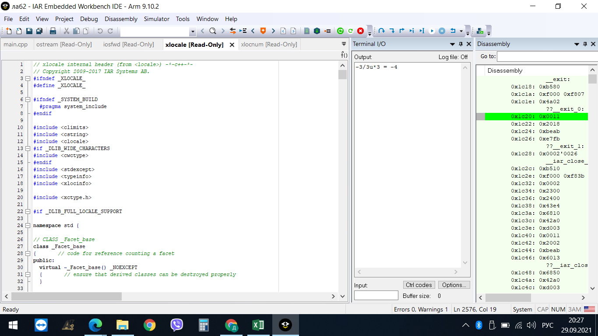
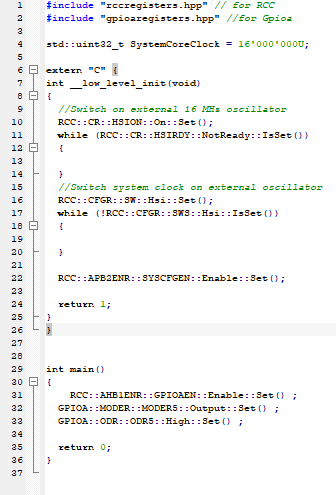
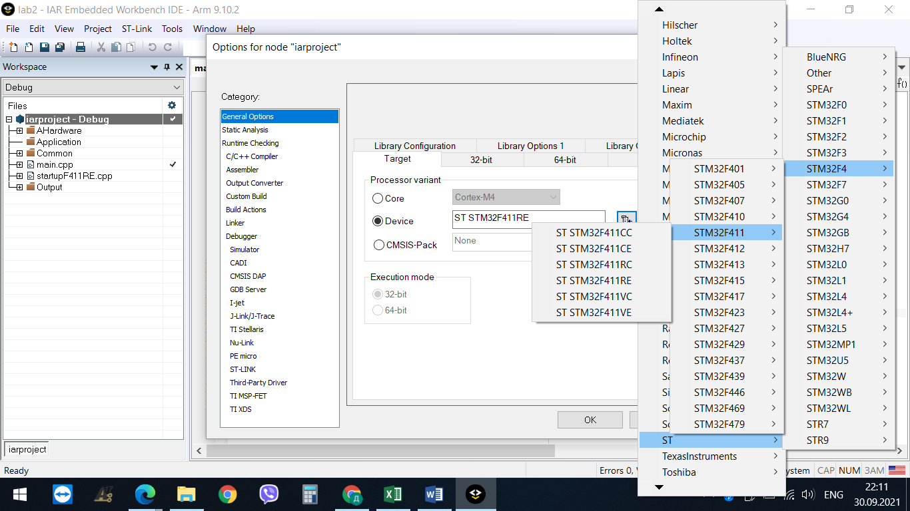
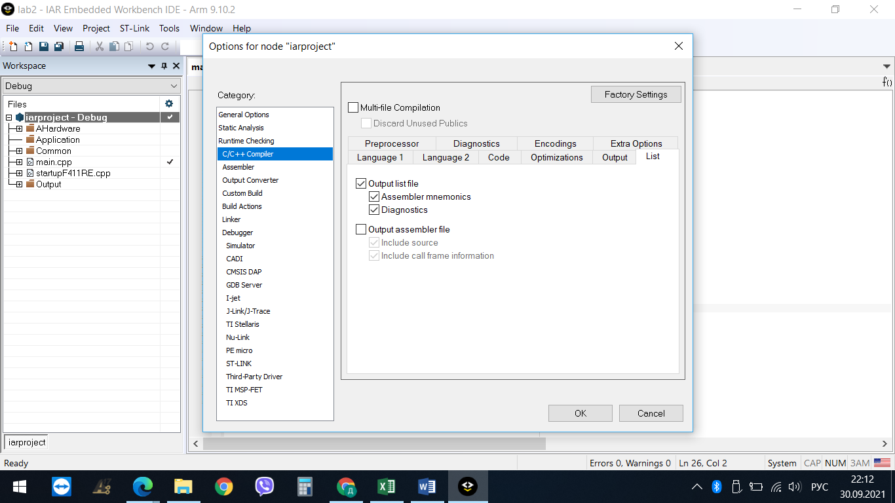
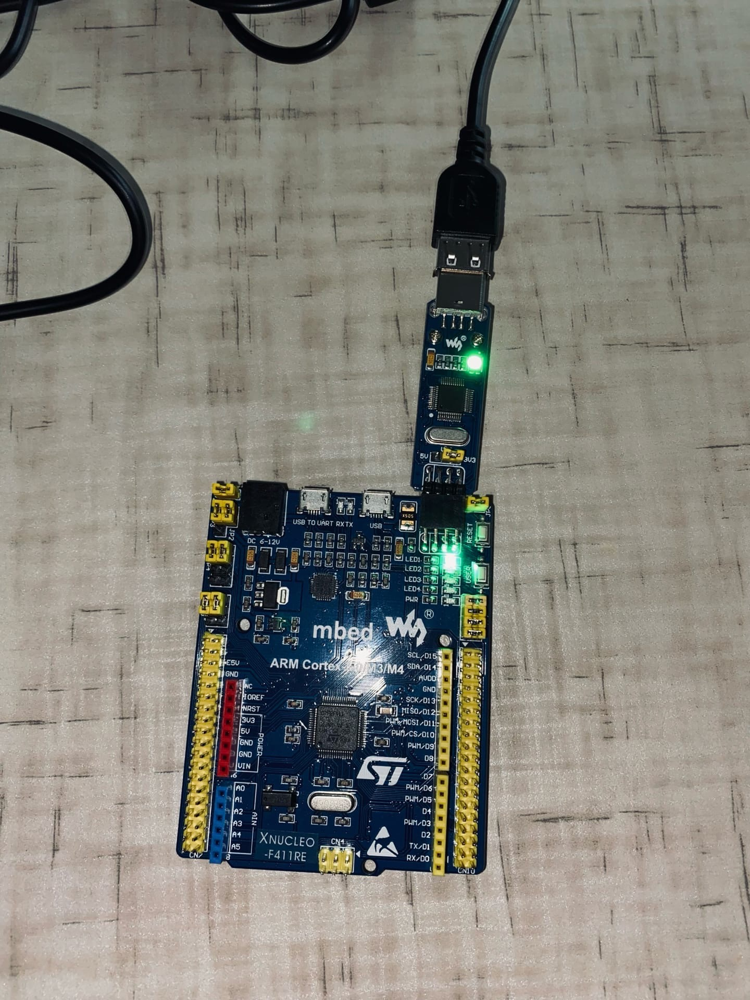
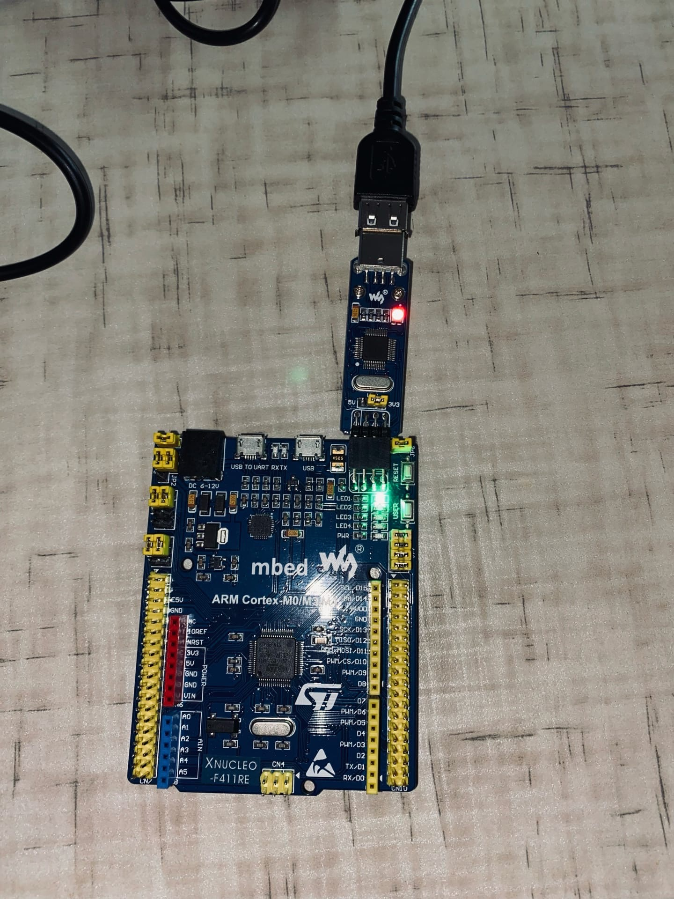

=== Лабораторная Работа №2
=== Выполнил: студент группы КЭ-413
=== Истомин Сергей Владимирович
== Задание
* Написать программу вычисляющую следующее выражение -3/3U *3 ,удивиться увиденному и объяснить результат.
Программа выглядит так:
std::cout << "-3/3u*3 = " << int(-3/3u*3) << "\n";

на экране видно что результат получился -4, это можно объяснить тем, что когда ранг преобразования беззнакового операнда меньше или равен рангу знакового операнда, то беззнаковый операнд приводится к типу беззнакового.

Для проверки представим все числа в дополнительном коде.

-3=11111111111111111111111111111101b

В беззнаковом представлении 11111111111111111111111111111101 = 4294967293

Таким образом -3 превращается в 4294967293 и делится на 3 = 1431655764,333.

Дробная часть отпадает.

Умножаем на 3, получаем 1431655764 * 3 = 4 294 967 292 = 11111111111111111111111111111100.

В дополнительном коде 11111111111111111111111111111100=-4

== Перейдем ко второй части задания
* Подключить плату к компьютеру, запустить на плате Lab1.
* Запустим IAR и скачаем из Lab1 файл iarproject.ewp
* добавим main код для зажигания светодиодов

[qanda]
----
RCC::AHB1ENR::GPIOAEN::Enable::Set() ;
GPIOA::MODER::MODER5::Output::Set() ;
GPIOA::ODR::ODR5::High::Set() ;
----

Далее заходим в options и выбираем плату.

Затем во вкладке C/C++ переходим во вкладку List и убираем нижнюю галочку.

Во вкладке Debugger выбираем ST-Link.

image::1.png[]

После настройки подключим плату к компьютеру.

Загрузим код в плату и посмотрим на результат.

